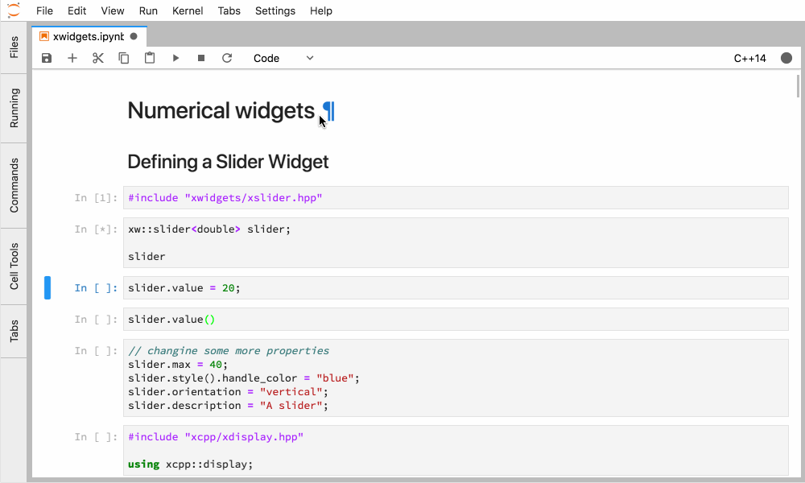

# 

[](https://travis-ci.org/QuantStack/xwidgets)
[](https://ci.appveyor.com/project/QuantStack/xwidgets)
[](https://xwidgets.readthedocs.io/en/latest/?badge=latest)
[](https://mybinder.org/v2/gh/QuantStack/xwidgets/0.11.1?filepath=notebooks/xwidgets.ipynb)
[](https://gitter.im/QuantStack/Lobby?utm_source=badge&utm_medium=badge&utm_campaign=pr-badge&utm_content=badge)

The C++ backend for Jupyter interactive widgets.

## Introduction

`xwidgets` is a C++ implementation of the Jupyter interactive widgets protocol.
The Python reference implementation is available in the
[ipywidgets](https://github.com/jupyter-widgets/ipywidgets) project.

`xwidgets` enables the use of the Jupyter interactive widgets in the C++
notebook, powered by the `xeus-cling` kernel and the `cling` C++ interpreter
from CERN. `xwidgets` can also be used to create applications making use of the
Jupyter interactive widgets without the C++ kernel *per se*.

## Usage

Launch the jupyter notebook with `jupyter notebook` and launch a new C++
notebook by selecting the **xeus C++14** kernel in the *new* dropdown.



## Installation

We provide a package for the conda package manager.

- Installing `xwidgets` and the C++ kernel

```bash
conda install xeus-cling xwidgets -c QuantStack -c conda-forge
```

Then, the front-end extension must be installed for either the classic notebook
or JupyterLab.

- Installing the extension for the classic notebook

```
conda install widgetsnbextension -c conda-forge
```

- Installing the JupyterLab extension

```
jupyter labextension install @jupyter-widgets/jupyterlab-manager
```

This command defaults to installing the latest version of the JupyterLab
extension. Depending on the version of `xwidgets` and `jupyterlab` you have
installed you may need an older version.

## Jupyterlab extension version compatibility

Specific version of

## Installation from sources

Or you can directly install it from the sources if you have all the
dependencies already installed:

```bash
cmake -D CMAKE_INSTALL_PREFIX=your_install_prefix
make install
```

## Trying it online

To try out xwidgets interactively in your web browser, just click on the binder
link:

[](https://mybinder.org/v2/gh/QuantStack/xwidgets/0.11.1?filepath=notebooks/xwidgets.ipynb)

## Documentation

To get started with using `xwidgets`, check out the full documentation

http://xwidgets.readthedocs.io/

## Dependencies

All the dependencies of xwidgets are available for the conda package manager.

| `xwidgets` | `widgetsnbextension`  |     `xtl`      | `xproperty`   | `xeus`          | `nlohmann_json` |
|------------|-----------------------|----------------|---------------|-----------------|-----------------|
|  master    |      ~3.0.0           |  >=0.4.8,<0.5  | >=0.7.0,<0.8  | >=0.12.0,<0.13  | >=3.1.1,<4.0    |
|  0.11.1    |      ~3.0.0           |  >=0.4.8,<0.5  | >=0.7.0,<0.8  | >=0.12.0,<0.13  | >=3.1.1,<4.0    |
|  0.11.0    |      ~3.0.0           |  >=0.4.8,<0.5  | >=0.7.0,<0.8  | >=0.12.0,<0.13  | >=3.1.1,<4.0    |
|  0.10.0    |      ~3.0.0           |  >=0.4.0,<0.5  | >=0.7.0,<0.8  | >=0.12.0,<0.13  | >=3.1.1,<4.0    |
|  0.9.0     |      ~3.0.0           |  >=0.4.0,<0.5  | >=0.7.0,<0.8  | >=0.12.0,<0.13  | >=3.1.1,<4.0    |
|  0.8.2     |      ~3.0.0           |  >=0.4.0,<0.5  | >=0.7.0,<0.8  | >=0.11.0,<0.12  | >=3.1.1,<4.0    |
|  0.8.1     |      ~3.0.0           |  >=0.4.0,<0.5  | >=0.7.0,<0.8  | >=0.11.0,<0.12  | >=3.1.1,<4.0    |
|  0.8.0     |      ~3.0.0           |  >=0.4.0,<0.5  | >=0.7.0,<0.8  | >=0.11.0,<0.12  | >=3.1.1,<4.0    |
|  0.7.x     |      ~3.0.0           |  >=0.4.0,<0.5  | >=0.7.0,<0.8  | >=0.10.1,<0.11  |                 |
|  0.6.1     |      ~3.0.0           |  >=0.4.0,<0.5  | >=0.6.0,<0.7  | >=0.8.0,<0.9    |                 |
|  0.6.0     |      ~3.0.0           |  >=0.3.5,<0.4  | >=0.6.0,<0.7  | >=0.8.0,<0.9    |                 |

## License

We use a shared copyright model that enables all contributors to maintain the
copyright on their contributions.

This software is licensed under the BSD-3-Clause license.
See the [LICENSE](LICENSE) file for details.
